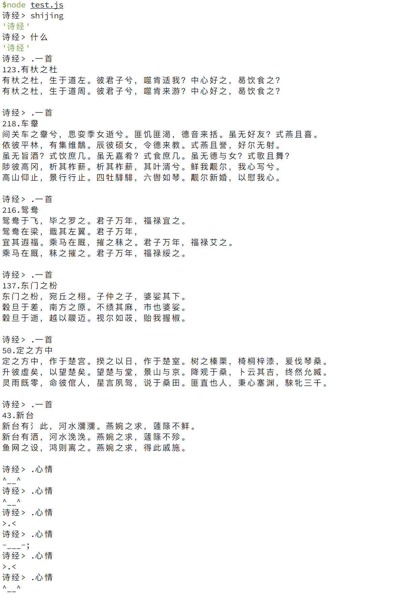

# 诗经 | shijing

桃之夭夭，灼灼其华。 ---《国风.周南.桃夭》


[](https://travis-ci.org/fluency03/shijing)
[](https://www.npmjs.com/package/shijing)
[](https://www.npmjs.com/package/shijing)
[](https://opensource.org/licenses/MIT)


## CLI Commands

### shijing

```javascript
诗经> shijing
'诗经'
```

### 什么

```javascript
诗经> 什么
'诗经'
```

### .一首

随机显示一篇诗文。

```javascript
诗经> .一首

国风.召南.甘棠
蔽芾甘棠，勿剪勿伐，召伯所茏。
蔽芾甘棠，勿剪勿败，召伯所憩。
蔽芾甘棠，勿剪勿拜，召伯所说。

诗经> .一首

国风.郑风.野有蔓草
野有蔓草，零露漙兮。有美一人，清扬婉兮。邂逅相遇，适我愿兮。
野有蔓草，零露瀼瀼。有美一人，婉如清扬。邂逅相遇，与子偕臧。

诗经> .一首

国风.郑风.山有扶苏
山有扶苏，隰有荷华。不见子都，乃见狂且。
山有乔松，隰有游龙，不见子充，乃见狡童。

诗经> .一首

国风.齐风.敝笱
敝笱在梁，其鱼鲂鳏。齐子归止，其从如云。
敝笱在梁，其鱼鲂鱮。齐子归止，其从如雨。
敝笱在梁，其鱼唯唯。齐子归止，其从如水。

诗经> .一首

小雅.鹿鸣之什.皇皇者华
皇皇者华，于彼原隰。駪駪征夫，每怀靡及。
我马维驹，六辔如濡。载驰载驱，周爰咨诹。
我马维骐，六辔如丝。载驰载驱，周爰咨谋。
我马维骆，六辔沃若。载驰载驱，周爰咨度。
我马维骃，六辔既均。载驰载驱，周爰咨询。

诗经> .一首

小雅.鸿雁之什.斯干
秩秩斯干，幽幽南山。如竹苞矣，如松茂矣。兄及弟矣，式相好矣，无相犹矣。
似续妣祖，筑室百堵，西南其户。爰居爰处，爰笑爰语。
约之阁阁，椓之橐橐。风雨攸除，鸟鼠攸去，君子攸芋。
如跂斯翼，如矢斯棘，如鸟斯革，如翚斯飞，君子攸跻。
殖殖其庭，有觉其楹。哙哙其正，哕哕其冥。君子攸宁。
下莞上簟，乃安斯寝。乃寝乃兴，乃占我梦。吉梦维何？维熊维罴，维虺维蛇。
大人占之：维熊维罴，男子之祥；维虺维蛇，女子之祥。
乃生男子，载寝之床。载衣之裳，载弄之璋。其泣喤喤，朱芾斯皇，室家君王。
乃生女子，载寝之地。载衣之裼，载弄之瓦。无非无仪，唯酒食是议，无父母诒罹。

诗经> .一首

大雅.荡之什.崧高
崧高维岳，骏极于天。维岳降神，生甫及申。维申及甫，维周之翰。四国于蕃。四方于宣。
亹亹申伯，王缵之事。于邑于谢，南国是式。王命召伯，定申伯之宅。登是南邦，世执其功。
王命申伯，式是南邦。因是谢人，以作尔庸。王命召伯，彻申伯土田。王命傅御，迁其私人。
申伯之功，召伯是营。有俶其城，寝庙既成。既成藐藐，王锡申伯。四牡蹻蹻，钩膺濯濯。
王遣申伯，路车乘马。我图尔居，莫如南土。锡尔介圭，以作尔宝。往近王舅，南土是保。
申伯信迈，王饯于郿。申伯还南，谢于诚归。王命召伯，彻申伯土疆。以峙其粻，式遄其行。
申伯番番，既入于谢。徒御啴啴。周邦咸喜，戎有良翰。不显申伯，王之元舅，文武是宪。
申伯之德，柔惠且直。揉此万邦，闻于四国。吉甫作诵，其诗孔硕。其风四好，以赠申伯。

诗经> .一首

国风.邶风.终风
终风且暴，顾我则笑，谑浪笑敖，中心是悼。
终风且霾，惠然肯来，莫往莫来，悠悠我思。
终风且曀，不日有曀，寤言不寐，愿言则嚏。
曀曀其阴，虺虺其雷，寤言不寐，愿言则怀。

诗经> .一首

小雅.节南山之什.小弁
弁彼鸴斯，归飞提提。民莫不穀，我独于罹。何辜于天？我罪伊何？心之忧矣，云如之何？
踧踧周道，鞫为茂草。我心忧伤，惄焉如捣。假寐永叹，维忧用老。心之忧矣，疢如疾首。
维桑与梓，必恭敬止。靡瞻匪父，靡依匪母。不属于毛？不罹于里？天之生我，我辰安在？
菀彼柳斯，鸣蜩嘒嘒，有漼者渊，萑苇淠淠。譬彼舟流，不知所届，心之忧矣，不遑假寐。
鹿斯之奔，维足伎伎。雉之朝雊，尚求其雌。譬彼坏木，疾用无枝。心之忧矣，宁莫之知？
相彼投兔，尚或先之。行有死人，尚或墐之。君子秉心，维其忍之。心之忧矣，涕既陨之。
君子信谗，如或酬之。君子不惠，不舒究之。伐木掎矣，析薪扡矣。舍彼有罪，予之佗矣。
莫高匪山，莫浚匪泉。君子无易由言，耳属于垣。无逝我梁，无发我笱。我躬不阅，遑恤我后。

诗经> .一首

国风.齐风.着
俟我于着乎而，充耳以素乎而，尚之以琼华乎而。
俟我于庭乎而，充耳以青乎而，尚之以琼莹乎而。
俟我于堂乎而，充耳以黄乎而，尚之以琼英乎而。

诗经> .一首

小雅.鸿雁之什.我行其野
我行其野，蔽芾其樗。婚姻之故，言就尔居。尔不我畜，复我邦家。
我行其野，言采其蓫。婚姻之故，言就尔宿。尔不我畜，言归斯复。
我行其野，言采其葍。不思旧姻，求尔新特。成不以富，亦祗以异。

诗经> .一首

国风.郑风.羔裘
羔裘如濡，洵直且侯。彼其之子，舍命不渝。
羔裘豹饰，孔武有力。彼其之子，邦之司直。
羔裘晏兮，三英粲兮。彼其之子，邦之彦兮。

```

### .编号

显示指定编号诗文。编号范围：`一 ～ 三百零五`。

```javascript
诗经> .编号 五十五

国风.卫风.淇奥
瞻彼淇奥，绿竹猗猗。有匪君子，如切如磋，如琢如磨，瑟兮僴兮，赫兮咺兮。有匪君子，终不可谖兮。
瞻彼淇奥，绿竹青青。有匪君子，充耳秀莹，会弁如星。瑟兮僴兮。赫兮咺兮，有匪君子，终不可谖兮。
瞻彼淇奥，绿竹如箦。有匪君子，如金如锡，如圭如璧。宽兮绰兮，猗重较兮。善戏谑兮，不为虐兮。

诗经> .编号 三十八

国风.邶风.简兮
简兮简兮，方将万舞。日之方中，在前上处。
硕人俣俣，公庭万舞。有力如虎，执辔如组。
左手执龠，右手秉翟。赫如渥赭，公言锡爵。
山有榛，隰有苓。云谁之思？西方美人。彼美人兮，西方之人兮。

诗经> .编号 十

国风.周南.汝坟
遵彼汝坟，伐其条枚。未见君子，惄如调饥。
遵彼汝坟，伐其条肄。既见君子，不我遐弃。
鲂鱼赪尾，王室如毁。虽则如毁，父母孔迩。

诗经> .编号 九十九

国风.齐风.东方之日
东方之日兮，彼姝者子，在我室兮。在我室兮，履我即兮。
东方之月兮，彼姝者子，在我闼兮。在我闼兮，履我发兮。

诗经> .编号 二百五十一

大雅.生民之什.泂酌
泂酌彼行潦，挹彼注兹，可以餴饎。岂弟君子，民之父母。
泂酌彼行潦，挹彼注兹，可以濯罍。岂弟君子，民之攸归。
泂酌彼行潦，挹彼注兹，可以濯溉。岂弟君子，民之攸墍。

```

### .心情

随机显示一个Emoji。

```javascript
诗经> .心情
🐢
诗经> .心情
💖
诗经> .心情
🚝
诗经> .心情
🤘
诗经> .心情
🌓
诗经> .心情
🌯
诗经> .心情
🇳🇨
诗经> .心情
🇨🇺
诗经> .心情
🐩
诗经> .心情
🗽
诗经> .心情
🌙
诗经> .心情
🚿
```

## Demo

<!--  -->


[npm-image]: https://img.shields.io/npm/v/express.svg
[npm-url]: https://www.npmjs.com/package/shijing
[downloads-image]: https://img.shields.io/npm/dm/express.svg
[downloads-url]: https://www.npmjs.com/package/shijing
